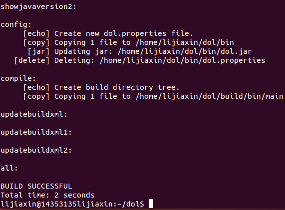
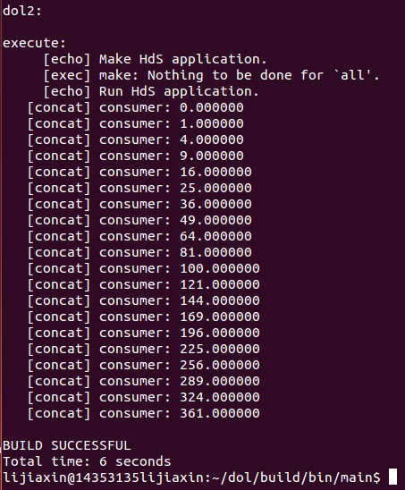

#DOL安装笔记
***
##一、DOL框架描述
  >引言：
  >The distributed operation layer (DOL) is a framework that enables the (semi-) automatic mapping of applications onto the multiprocessor SHAPES architecture platform. The DOL consists of basically three parts: 
  >
  * DOL Application Programming Interface: The DOL defines a set of computation and communication routines that enable the programming of distributed, parallel applications for the SHAPES platform. Using these routines, application programmers can write programs without having detailed knowledge about the underlying architecture. In fact, these routines are subject to further refinement in the hardware dependent software (HdS) layer. 
  * DOL Functional Simulation: To provide programmers a possibility to test their applications, a functional simulation framework has been developed. Besides functional verification of applications, this framework is used to obtain performance parameters at the application level. 
  * DOL Mapping Optimization: The goal of the DOL mapping optimization is to compute a set of optimal mappings of an application onto the SHAPES architecture platform. In a first step, XML based specification formats have been defined that allow to describe the application and the architecture at an abstract level. Still, all the information necessary to obtain accurate performance estimates is contained. 
***
##二、安装笔记
  
###1. 安装一些必要的环境：
  	   - $ sudo apt-get update
	   - $ sudo apt-get install ant
       - $ sudo apt-get install openjdk-7-jdk
       - $ sudo apt-get install unzip
###2. 解压文件，将dolethz.zip和systemc-2.3.1.tgz进行解压
       - $ unzip dol_ethz.zip -d dol
	   - $ tar -zxvf systemc-2.3.1.tgz
###3. 编译
####(1). 运行configure(能根据系统的环境设置一下参数，用于编译)
       - $../configure CXX=g++ --disable-async-updates
####(2). 编译并记录路径
       - $ sudo make install
	   - $ pwd
###4. 编译dol
####(1)修改build_zip.xml文件
       - <property name="systemc.inc" value="YYY/include"/>
       - <property name="systemc.lib" value="YYY/lib-linux/libsystemc.a"/>
  把YYY改成上页pwd的结果
####(2)编译
       - $ ant -f build_zip.xml all
  成功结果，如图所示：

####(3)运行第一个样例
       - $ cd build/bin/main
	   - $ sudo ant -f runexample.xml -Dnumber=1
  成功结果，如图所示:

#三、实验感想
   这次的实验就DOL的配置来说是比较简单的，只需要按照上面所写的流程就可以成功，而唯一停留的时间比较长的地方就是最后一步跑一个样例总是build failed，试过了很多办法，比如，加上sudo，或者安装一下jdk，或者dol/build/bin/main下的runexample.xml进行注释或删除，不断地build但是总是失败。最后终于找到原因，使用pwd显示路径的时候，没有复制好，粘贴在文件的时候，被自动换行了，却因为路径其实快到行末而忽视了这个问题，所以build dol2时总会给出路径，并说No such file。
