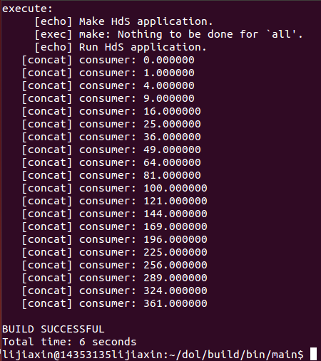
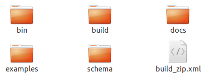
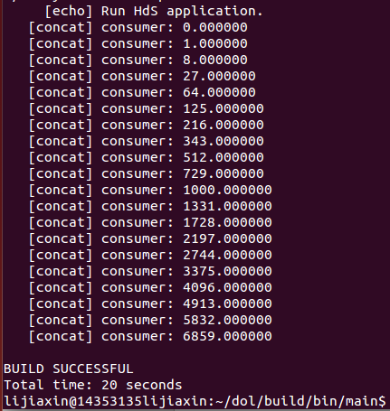
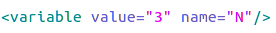
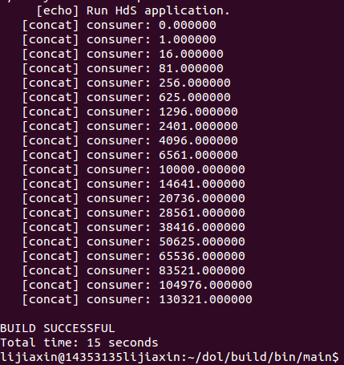
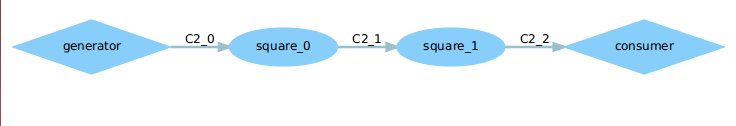

</head>
<body marginheight="0"><h1>一、修改example1使其输出三次方数</h1>
<h2>1、未修改前</h2>

<h2>2、将dol文件夹中的build文件删除，否则任何修改对结果不会产生改变</h2>

<h2>3、将example1中的square文件中的i = i x i改成 i = i x i x i</h2>
<h2>4、进入dol中，重新编译一次：</h2>
<pre><code>ant –f build_zip.xml all</code></pre>
<h2>5、进入到build/bin/main，中重新运行一次，得到如图结果：</h2>
<pre><code>Sudo ant –f runexample.xml –Dnumber=1</code></pre>

运行结果如图所示：

<h1>二、修改example2,让3个square模块变成两个</h1>
<h2>1、打开example2.xml文件</h2>
<h2>2、将example2.xml文件中的value = 3改为value=2</h2>

<h2>3、将dol文件中的build文件删除</h2>
<h2>4、在dol下重新编译</h2>
<pre><code>ant –f build_zip.xml all</code></pre>
<h2>5、进入build/bin/main目录下，运行：</h2>
<pre><code>sudo ant –f runexample.xml –Dnumber=2</code></pre>

得到如图结果：

<h2>6、查看example2.dot图</h2>

<h1>三、实验感想</h1>

   在本次实验中，要注意的地方有两点：第一个就是将build文件删除，我原先是没有将它删除的，然后，不管我对i进行怎样的更改，运行的结果仍然是原始的结果；第二个就是在删减square模块时，不需要修改端口。Square是迭代生成的，所以value是决定模块数量的最根本的变量。而当我尝试去修改origin和target的时候，就会报错，给出一个路径，并说明这个路径不存在。

Edit By <a href="http://mahua.jser.me">MaHua</a>

</body></html>
