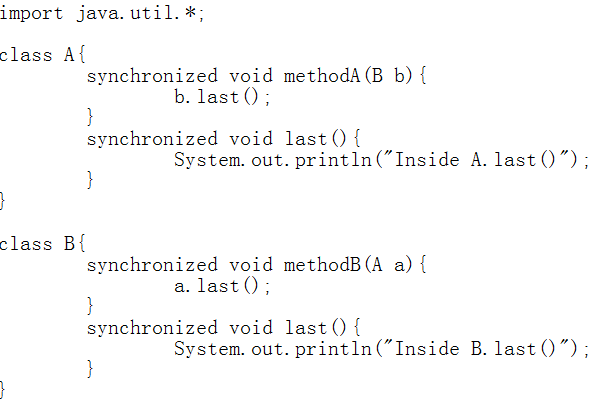
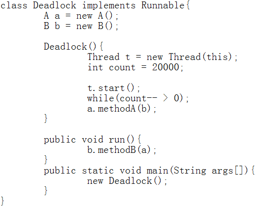
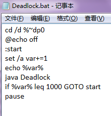
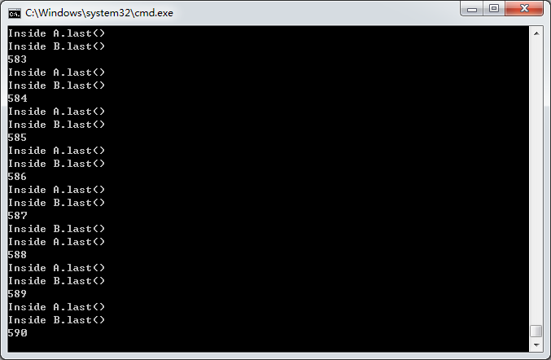

</head>
<body marginheight="0"><h1>在Windows系统下完成死锁的实验</h1>
<h2>一、实验步骤</h2>
<h3>1.编写代码，并保存为Deadlock.java</h3>
<h4>代码如图所示：</h4>

<h3>2.新建一个TXT文件保存为Deadlock.bat</h3>
<h4>内容如下：</h4>

<h2>二、死锁的实验截图</h2>

<h4>如图所示，在第590次的时候产生了死锁</h4>
<h2>三、产生死锁的四个条件：</h2>
<h3>1.互斥条件：一个资源每次只能被一个进程使用</h3>
<h3>2.请求与保持条件：一个进程因请求资源而阻塞时，对已获得的资源保持不放</h3>
<h3>3.不剥夺条件:进程已获得的资源，在末使用完之前，不能强行剥夺</h3>
<h3>4.循环等待条件:若干进程之间形成一种头尾相接的循环等待资源关系</h3>
<h2>四、程序产生死锁的原因</h2>
<h4>从程序的运行步骤来分析：</h4>
<h3>1、运行Deadlock这个函数；</h3>
<h5>在这个函数中：</h5>
<h4>①创建了一个进程t</h4>
<h4>②进程t开始运行，并调用run函数；</h4>
<h4>③在run函数中，B调用a的last()函数，等待一会后，A又调用b的last()函数。</h4>
<h3>2、分析</h3>

在这个过程中，如果B中methodB调用a的last()函数，那么在此期间任何访问b的last()函数的线程是被阻塞的；而A中执行methodA函数去调用b的last()函数，此时任何访问a的last()的函数的线程是被阻塞的。故，当B在method函数中准备调用a的last()函数，而A在method中准备调用b的last()函数，两者都占有了一部分资源，等待对方释放另一部分资源的时候，死锁就产生了。

Edit By <a href="http://mahua.jser.me">MaHua</a>

</body></html>
