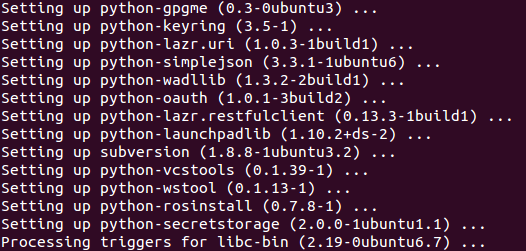
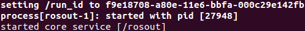
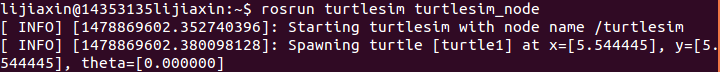
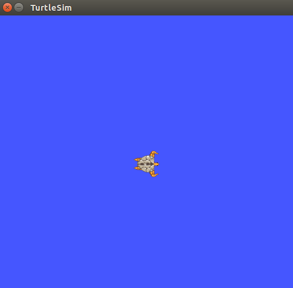
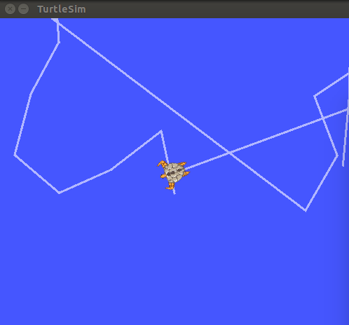

<html lang="en"><head>
    <meta charset="UTF-8">
    <title></title>
</head>
<body marginheight="0"><h1>实验五：配置Ros</h1>
<h2>一、Installation</h2>
<h3>1.Setup source list</h3>
<pre><code>sudo sh -c 'echo "deb http://packages.ros.org/ros/ubuntu $(lsb_release -sc) main" &gt; /etc/apt/sources.list.d/ros-latest.list'</code></pre>
<h3>2.set up keys</h3>
<pre><code>sudo apt-key adv --keyserver hkp://ha.pool.sks-keyservers.net:80 --recv-key 0xB01FA116</code></pre>
<h3>3.installation</h3>
<pre><code>sudo apt-get update</code></pre>
<h4>select Desktop full install</h4>
<pre><code>sudo apt-get install ros-jade-desktop-full</code></pre>
<h4>To find available packages, use:</h4>
<pre><code>apt-cache search ros-jade</code></pre>
<h3>4.Initailize rosdep</h3>
<pre><code>sudo rosdep init
rosdep update</code></pre>
<h3>5.setup environment</h3>
<pre><code>echo "source /opt/ros/jade/setup.bash" &gt;&gt; ~/.bashrc
source ~/.bashrc</code></pre>
<h3>6.getting rosinstall</h3>
<pre><code>sudo apt-get install python-rosinstall</code></pre>
<h4>最后的一部分：</h4>

<h2>二、Test for ros</h2>
<h3>1.打开终端，输入</h3>
<pre><code>roscore</code></pre>
<h4>结果如图：</h4>

<h3>2.打开第二个终端，输入：</h3>
<pre><code>rosrun turtlesim turtlesim_node</code></pre>

<h4>可以看见一个有小乌龟的界面：</h4>

<h3>3.打开第三个终端，输入：</h3>
<pre><code>rosrun turtlesim turtle_teleop_key</code></pre>
<h4>读入键盘输入值，对小乌龟进行操作。</h4>
<h4>左箭头和右箭头表示方向，向上和向下箭头表示前进和后退，如图：</h4>

Edit By <a href="http://mahua.jser.me">MaHua</a>

</body></html>